<p align="center">
  
</p>

<h1 align="center">👑 Lighter and Princess</h1>
<p align="center"><b>Elevating Fashion with AI Intelligence and Seamless Experience</b></p>

<p align="center">
  
  
  
  
</p>

---

## 📖 Overview

**Lighter and Princess** is a sophisticated E-Commerce solution designed for the modern fashion industry. It integrates cutting-edge **AI Virtual Try-on** technology and **Intelligent Chatbots** to provide an immersive shopping experience. Built with a robust **Java Spring Boot** backend and a dynamic **React** frontend, it ensures security, scalability, and performance.

### 🚀 Key Innovations
*   **✨ Fitroom Virtual Try-on**: Experience clothes before you buy. Our AI-powered virtual fitting room uses the Fitroom API to show how clothes look on real-world models or avatars.
*   **🤖 Smart AI Assistant**: A personalized shopping guide powered by Groq LLM, helping users find the perfect outfit and answering any product queries in real-time.
*   **🛡️ Secure Architecture**: Implementing JWT Stateless Authentication for secure, scalable access across all devices.
*   **📊 Enterprise-Grade Admin Dashboard**: Deep business insights, automated order management, and intuitive inventory control.
*   **🌓 Adaptive UI**: Full support for **Dark & Light Themes** to provide a comfortable viewing experience at any time.

---

## 🛠️ Tech Stack

### Backend
- **Core**: Java 21, Spring Boot 3.4.2
- **Security**: Spring Security, JWT, OAuth2 (Google/Facebook)
- **Data**: Spring Data JPA, MySQL
- **Payments**: VNPay, PayPal SDK
- **Reporting**: Apache POI (Excel), OpenPDF (Invoices)

### Frontend
- **Framework**: React 19 + Vite
- **Styling**: Vanilla CSS (Variables-based Theming), Framer Motion
- **Charts**: Recharts (for Analytics)
- **Maps**: Leaflet (Optional utility)

### AI & Intelligence
- **Virtual Fitting**: Fitroom API
- **NLP/Chatbot**: Groq LLM API

---

## 📸 System Showcase
### 1️⃣ Customer Experience 🛍️
  <table width="100%">
  <tr>
    <td colspan="2" align="center">
      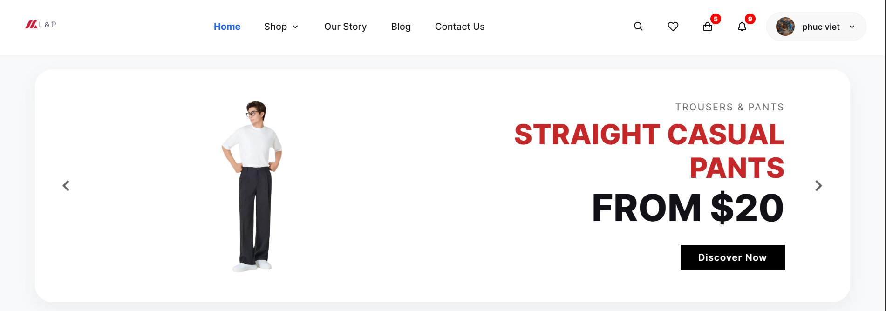<br/><br/>
      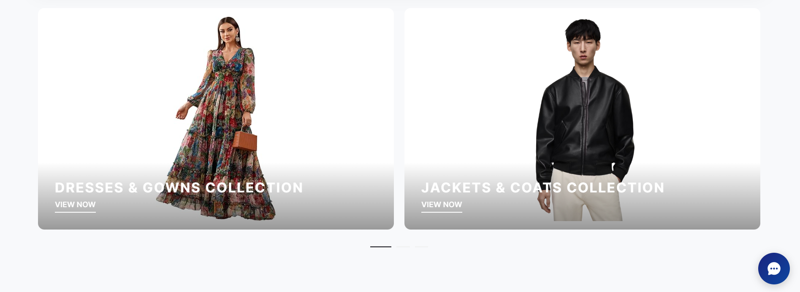<br/><br/>
      <b>Landing Page Showcase</b>
    </td>
  </tr>
  <tr>
    <td width="50%" align="center">
      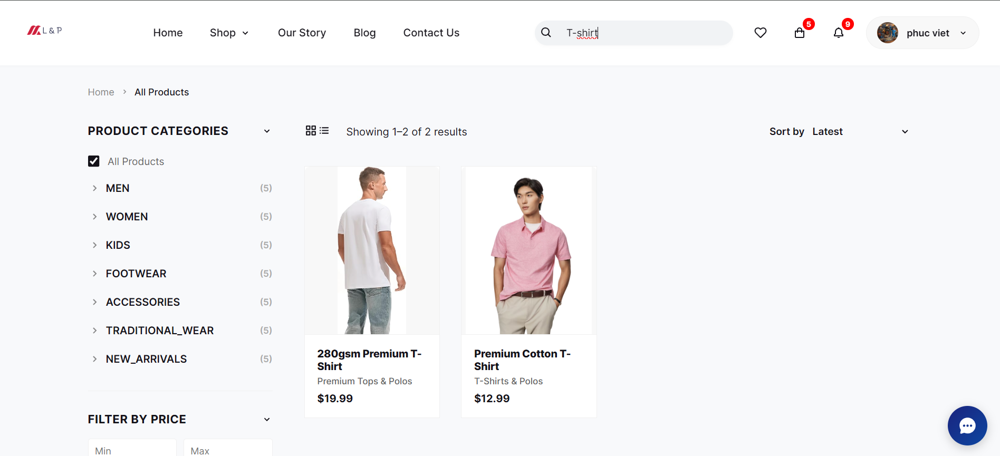<br/>
      <b>Smart Search & Gallery</b>
    </td>
    <td width="50%" align="center">
      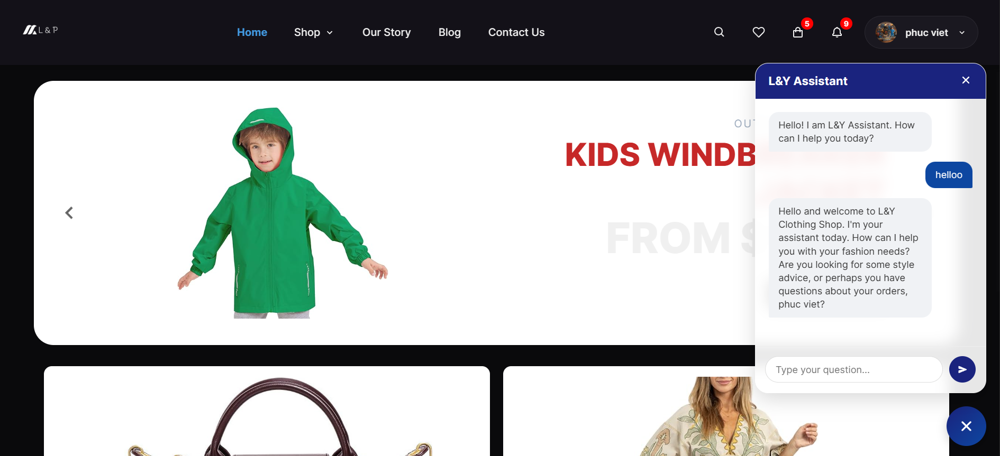<br/>
      <b>Groq AI Chatbot</b>
    </td>
  </tr>
  <tr>
    <td colspan="2" align="center">
      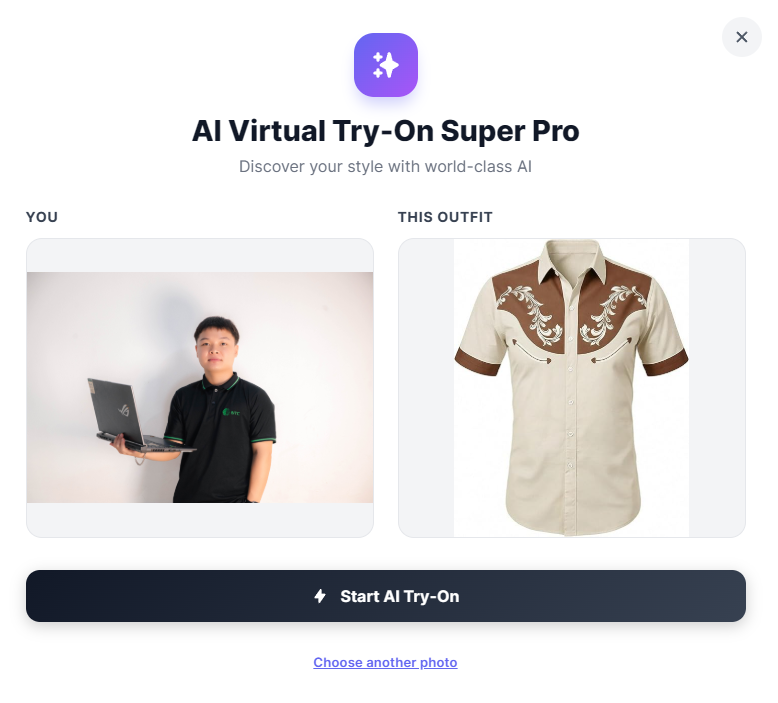<br/>
      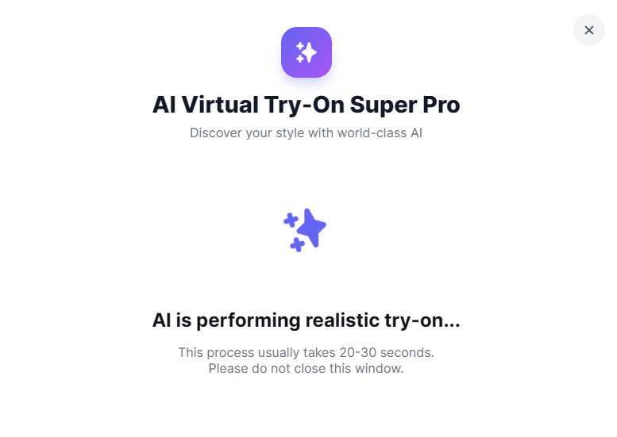<br/>
      <br/>
      <b>Fitroom AI Try-on</b>
    </td>
  </tr>
</table>

### 2️⃣ Checkout & Payments 💳
<table width="100%">
  <tr>
    <td width="33%" align="center">
      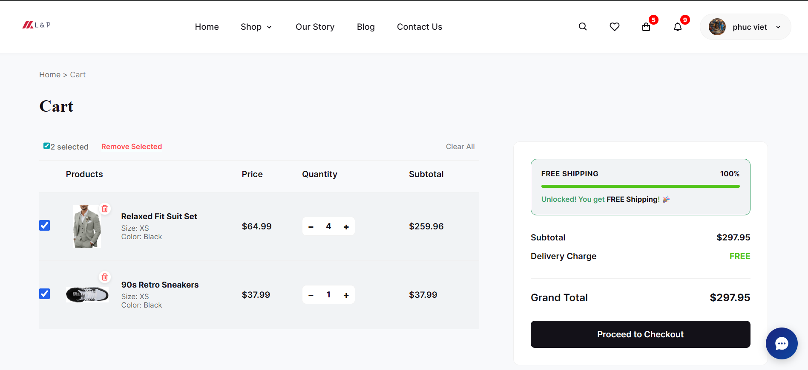<br/>
      <b>Dynamic Cart</b>
    </td>
    <td width="33%" align="center">
      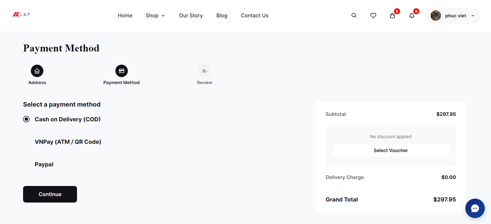<br/>
      <b>VNPay & PayPal</b>
    </td>
    <td width="33%" align="center">
      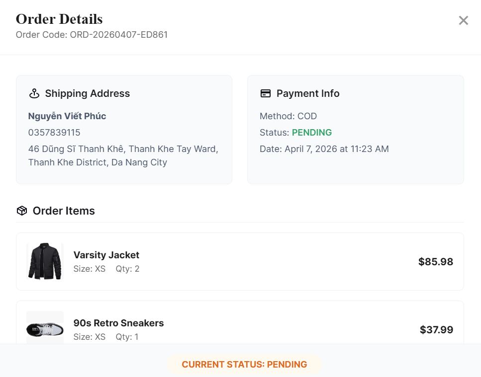<br/>
      <b>Order Status & Details</b>
    </td>
  </tr>
</table>

### 3️⃣ Administrative Intelligence ⚙️
<table width="100%">
  <tr>
    <td width="50%" align="center">
      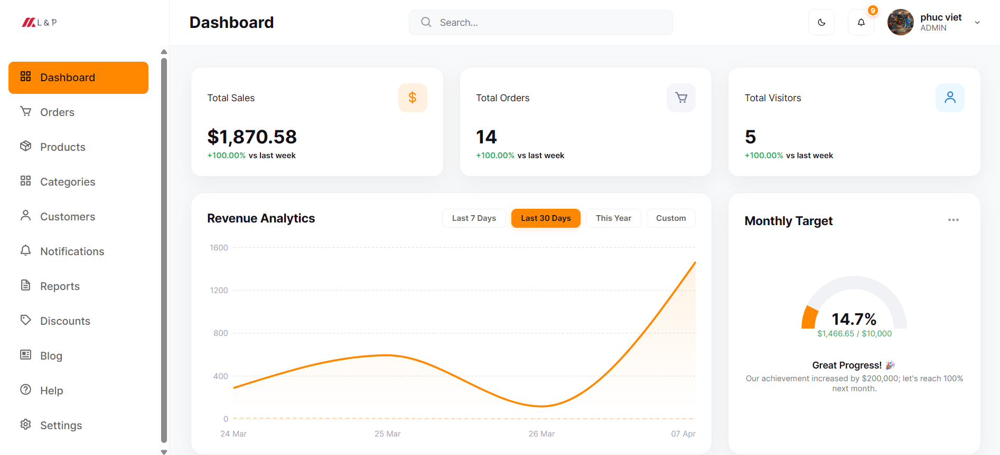<br/>
      <b>Sales Analytics</b>
    </td>
    <td width="50%" align="center">
      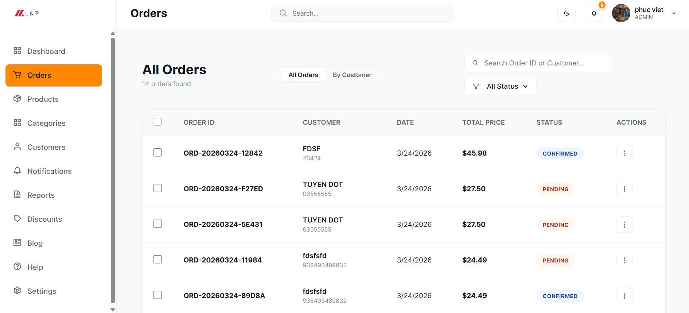<br/>
      <b>Order Command Center</b>
    </td>
  </tr>
  <tr>
    <td width="50%" align="center">
      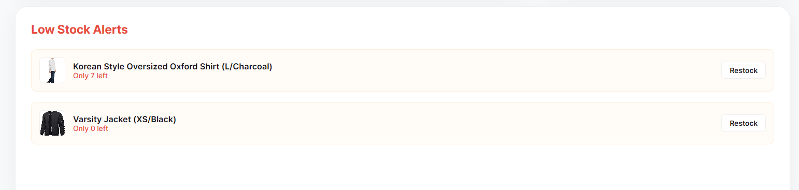<br/>
      <b>Inventory Control</b>
    </td>
    <td width="50%" align="center">
      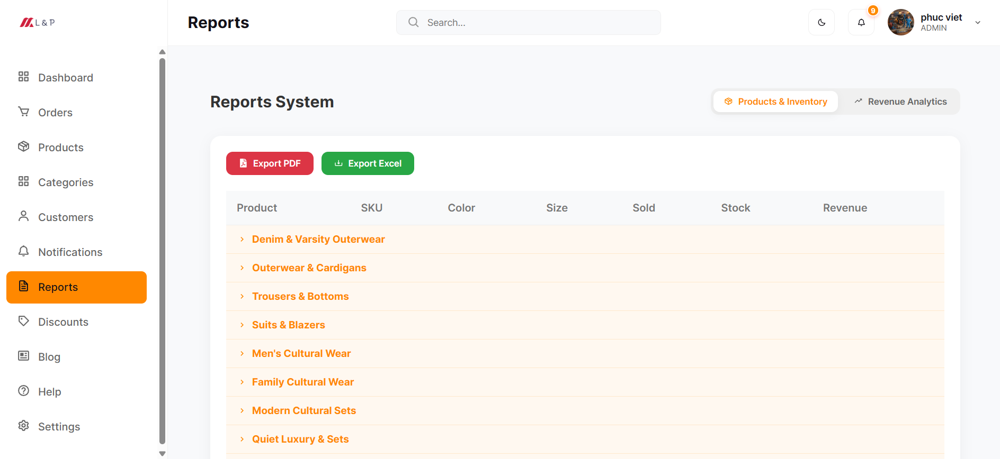<br/>
      <b>PDF/Excel Reports</b>
    </td>
  </tr>
</table>

### 4️⃣ UI Innovation & Security 🌓
<table width="100%">
  <tr>
    <td width="50%" align="center">
      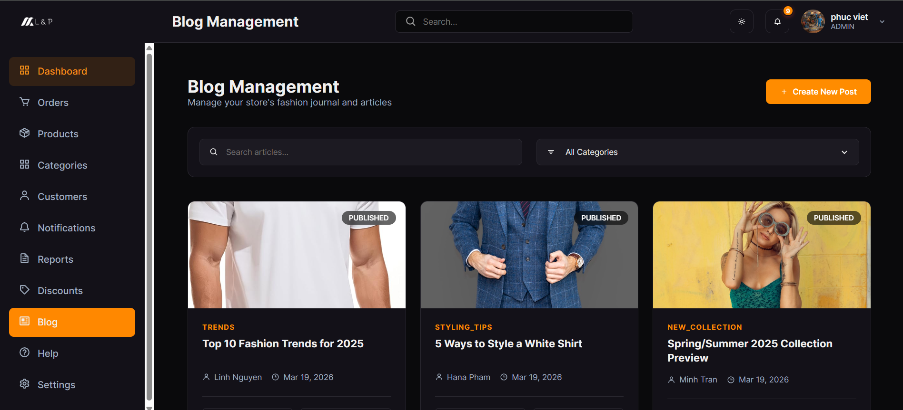<br/>
      <b>Stunning Dark Mode</b>
    </td>
    <td width="50%" align="center">
      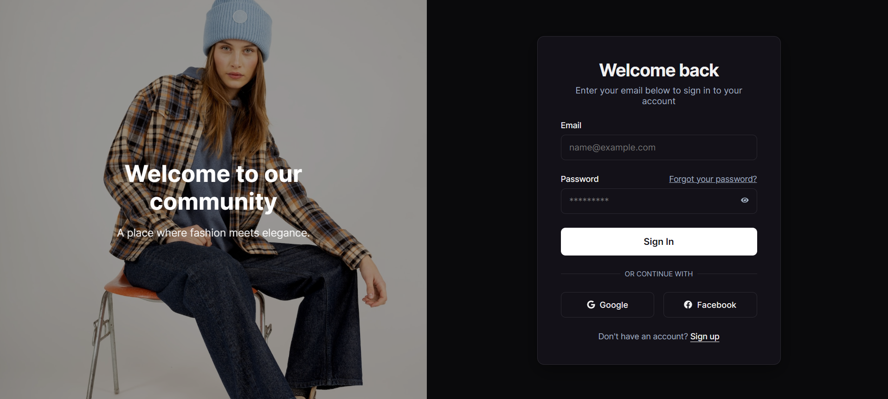<br/>
      <b>Google & FB Auth</b>
    </td>
  </tr>
</table>

---

## ⚙️ Getting Started

### Prerequisites
- **JDK 21**
- **Node.js (LTS)**
- **MySQL Server**
- **Maven**

### 1. Backend Configuration
Create a `.env` file in the `clothingsystem` directory and populate it with your credentials:

```bash
# Database & General
DB_URL=jdbc:mysql://localhost:3306/clothing_db
DB_USERNAME=your_username
DB_PASSWORD=your_password
JWT_SECRET=your_jwt_secret

# Social Login
GOOGLE_CLIENT_ID=...
GOOGLE_CLIENT_SECRET=...
FACEBOOK_CLIENT_ID=...
FACEBOOK_CLIENT_SECRET=...

# Mail Service
MAIL_HOST=smtp.gmail.com
MAIL_PORT=587
MAIL_USERNAME=...
MAIL_PASSWORD=...

# VNPay Payment
VNP_TMN_CODE=...
VNP_HASH_SECRET=...
VNP_PAY_URL=...

# PayPal Payment
PAYPAL_CLIENT_ID=...
PAYPAL_CLIENT_SECRET=...
PAYPAL_MODE=sandbox

# AI Configuration
GROQ_API_KEY=...
FITROOM_API_KEY=...
```

### 2. Execution
**Run Backend:**
```bash
cd clothingsystem
mvn spring-boot:run
```

**Run Frontend:**
```bash
cd frontend
npm install
npm run dev
```

---

## 📂 Project Structure

```text
.
├── clothingsystem/         # Java Spring Boot Backend
│   ├── src/main/java/      # Business Logic, Controllers, Services
│   ├── src/main/resources/ # Configuration & Static Assets
│   └── pom.xml             # Backend dependencies
├── frontend/               # React Vite Frontend
│   ├── src/components/     # Reusable UI Components
│   ├── src/pages/          # Application Pages
│   └── package.json        # Frontend dependencies
└── README.md               # Project documentation
```

---

## 🤝 Connect with me

<div align="center">
  <a href="https://github.com/PhucBITC">
    
  </a>
  <a href="#">
    
  </a>

   <a href="https://www.facebook.com/phuc.viet.656036/">
    
  </a>
</div>

<p align="center">Made with ❤️ for Fashion and Technology</p>
